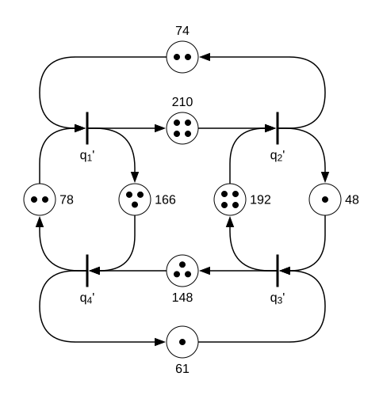

# max-plus-algorithms

This repository contains MATLAB implementations for the analysis of  
**max-plus linear systems**, with a focus on spectral properties and transient
behavior.

Max-plus algebra replaces classical addition and multiplication by:

- **Addition:**  
  a ⊕ b = max(a, b)

- **Multiplication:**  
  a ⊗ b = a + b

Such models arise naturally in **discrete-event systems**, **scheduling**,
**transportation networks**, and **timed Petri nets**.

---

## Repository Contents

### `howard.m`

Implementation of **Howard’s policy iteration algorithm** for computing a
**generalised max-plus eigenmode**.

Given a **higher-order** max-plus system, the algorithm computes:

- the **max-plus eigenvalue** (cycle mean),
- the associated **eigenvector**,
- a **critical node** belonging to a critical cycle.

---

### `lea.m`

Monte Carlo algorithm for estimating the **Lyapunov exponent** of
max-plus linear systems.

The algorithm:

- applies randomness to a max-plus matrix,
- propagates two trajectories with a fixed time shift that represent the
  **lower and upper bounds** of the Lyapunov exponent,
- estimates their mean values to obtain bounds on the Lyapunov exponent,
- computes **95% confidence intervals** from Monte Carlo samples.

In this algorithm, we assume that delays are added to the random matrix **A**
with some probability and are **exponentially distributed**. This can easily
be changed to any other distribution.

---

### `example_lea.m`

Example script demonstrating the use of `lea.m` for a simple timed events graph
shown in the figure below. The net has four transitions and eight places. We can
describe this net using a **higher-order recursive equation**, which can be
further transformed into a **first-order equation** with a single matrix **A**,
as shown in `example_lea.m`.

The script:

1. Defines a max-plus system matrix  
2. Sets algorithm parameters  
3. Runs the Monte Carlo estimation  
4. Returns deviation bounds and confidence intervals  

---

## Requirements

- MATLAB  
- No external toolboxes required

---

## References

- B. Heidergott, G. J. Olsder, J. van der Woude,  
  *Max Plus at Work*, Princeton University Press, 2006.

- R. M. P. Goverde, B. Heidergott, G. Merlet,  
  *A coupling approach to estimating the Lyapunov exponent of stochastic  
  max-plus linear systems*.

---

## License

This code is provided for research and educational purposes.
